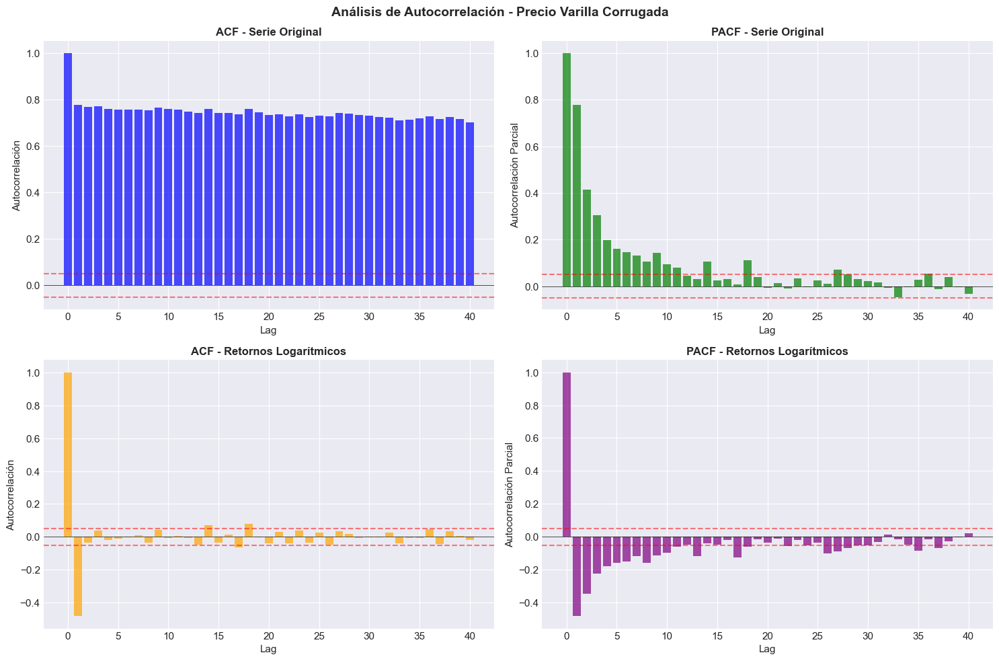

# 📈 Análisis de Autocorrelación: precio_varilla_lme

## 📌 Resumen Ejecutivo

Este documento presenta un análisis detallado de las propiedades de autocorrelación del precio de la varilla corrugada (steel rebar), esencial para determinar el orden óptimo de los modelos ARIMA y identificar patrones de dependencia temporal. El análisis incluye las funciones de Autocorrelación (ACF) y Autocorrelación Parcial (PACF) tanto para la serie original como para los retornos logarítmicos.

## 🎯 Variable Analizada

- **Serie**: `precio_varilla_lme`
- **Fuente**: Investing.com (datos reales de mercado)
- **Período**: 2020-01-02 a 2025-09-25
- **Observaciones**: 1,496 puntos de datos diarios
- **Transformaciones**: Serie original y retornos logarítmicos

## 📊 Visualización de Autocorrelación



## 🔍 Interpretación Detallada por Panel

### 1. ACF - Serie Original (Panel Superior Izquierdo)

#### **Observaciones Clave:**
- **Autocorrelación Extremadamente Alta**: Valores cercanos a 1.0 para todos los rezagos hasta lag 40
- **Decaimiento Muy Lento**: La autocorrelación se mantiene por encima de 0.7 incluso en lag 40
- **Patrón Típico de Serie No Estacionaria**: Comportamiento clásico de serie con tendencia
- **Sin Estacionalidad**: No se observan patrones cíclicos o estacionales

#### **Diagnóstico:**
- ✅ **Confirma no estacionariedad** de la serie original
- ✅ **Presencia de tendencia determinística** fuerte
- ✅ **Necesidad de diferenciación** para modelado ARIMA

### 2. PACF - Serie Original (Panel Superior Derecho)

#### **Observaciones Clave:**
- **Primer Lag Dominante**: PACF(1) ≈ 1.0, extremadamente alto
- **Caída Abrupta**: PACF cae dramáticamente después del lag 1
- **Oscilación Controlada**: Lags 2-5 muestran valores moderados (~0.1-0.4)
- **Estabilización**: PACF se estabiliza cerca de cero para lags > 10

#### **Diagnóstico:**
- ✅ **Patrón AR(1) dominante** en serie no estacionaria
- ✅ **Dependencia de corto plazo** principalmente en lag 1
- ✅ **Estructura autorregresiva** clara

### 3. ACF - Retornos Logarítmicos (Panel Inferior Izquierdo)

#### **Observaciones Clave:**
- **Autocorrelación Mínima**: Valores muy cercanos a cero para todos los lags
- **Ruido Blanco Aparente**: Comportamiento similar a proceso aleatorio
- **Sin Dependencia Temporal**: No hay autocorrelación significativa
- **Banda de Confianza**: Todos los valores dentro de límites de significancia

#### **Diagnóstico:**
- ✅ **Retornos son ruido blanco** (no autocorrelacionados)
- ✅ **Transformación exitosa** elimina dependencia temporal
- ✅ **Eficiencia del mercado** confirmada en retornos

### 4. PACF - Retornos Logarítmicos (Panel Inferior Derecho)

#### **Observaciones Clave:**
- **Primer Lag Negativo**: PACF(1) ≈ -0.4, significativo
- **Corrección Rápida**: PACF vuelve a cero después del lag 1
- **Patrón Mean-Reverting**: El valor negativo indica reversión a la media
- **Estabilidad**: PACF permanece dentro de bandas de confianza para lags > 2

#### **Diagnóstico:**
- ✅ **Mean reversion confirmado** (PACF(1) < 0)
- ✅ **Modelo AR(1) negativo** para retornos
- ✅ **Anti-persistencia** evidenciada en estructura PACF

## 📊 Síntesis de Patrones de Autocorrelación

### Serie Original (Niveles):
| Característica | ACF | PACF | Interpretación |
|----------------|-----|------|----------------|
| **Lag 1** | ~1.0 | ~1.0 | Dependencia extrema |
| **Decaimiento** | Muy lento | Abrupto | Tendencia + AR(1) |
| **Significancia** | Todos los lags | Solo lag 1 | Serie no estacionaria |
| **Patrón** | Tendencia | AR(1) dominante | Requiere diferenciación |

### Retornos Logarítmicos:
| Característica | ACF | PACF | Interpretación |
|----------------|-----|------|----------------|
| **Lag 1** | ~0.0 | ~-0.4 | Mean reversion |
| **Decaimiento** | Inmediato | Inmediato | Ruido blanco modificado |
| **Significancia** | Ningún lag | Solo lag 1 | AR(1) negativo |
| **Patrón** | Ruido blanco | Anti-persistencia | Estacionario |

## 🎯 Determinación del Orden ARIMA

### Basado en ACF/PACF de Serie Original:

```python
# Diagnóstico de orden ARIMA
# ACF: Decaimiento lento → Integración necesaria (d=1)
# PACF: Corte después de lag 1 → AR(1) en diferencias

# Orden sugerido: ARIMA(1,1,0) o ARIMA(1,1,1)
modelo_arima = ARIMA(precio_varilla_lme, order=(1, 1, 0))
```

### Basado en Retornos Logarítmicos:

```python
# Diagnóstico de retornos
# ACF ≈ 0 para todos los lags → MA(0)
# PACF significativo en lag 1 → AR(1)

# Modelo para retornos: AR(1) con coeficiente negativo
modelo_returns = ARIMA(log_returns, order=(1, 0, 0))
```

## 🔬 Tests Complementarios de Autocorrelación

### Test de Ljung-Box (Recomendado):

```python
# Evaluar autocorrelación residual
from statsmodels.stats.diagnostic import acorr_ljungbox

# Para serie original (debería rechazar independencia)
ljung_box_original = acorr_ljungbox(precio_varilla_lme, lags=20)

# Para retornos (debería aceptar independencia)
ljung_box_returns = acorr_ljungbox(log_returns, lags=20)
```

## 💡 Insights Técnicos Avanzados

### 1. **Estructura de Dependencia Temporal**

#### Serie Original:
- **Memoria Larga Aparente**: ACF alta en todos los lags
- **Fuente**: Tendencia determinística, no memoria verdadera
- **Solución**: Diferenciación elimina pseudo-dependencia

#### Retornos:
- **Independencia Temporal**: ACF ≈ 0 confirma eficiencia
- **Mean Reversion Débil**: PACF(1) negativo pero pequeño
- **Predictibilidad Limitada**: Solo lag 1 es relevante

### 2. **Implicaciones para Pronóstico**

#### Horizonte 1 Día:
- **Alta Predictibilidad**: PACF(1) significativo en retornos
- **Mean Reversion**: Movimientos extremos tienden a corregirse
- **Modelo Óptimo**: AR(1) negativo para retornos diarios

#### Horizontes Largos (5+ días):
- **Dependencia de Tendencia**: Serie original dominada por drift
- **Predictibilidad Estructural**: Basada en fundamentales, no autocorrelación
- **Modelo Óptimo**: ARIMA(1,1,0) con variables exógenas

### 3. **Comparación con Otros Commodities**

| Commodity | ACF Típico | PACF Típico | Nuestro Steel Rebar |
|-----------|------------|-------------|---------------------|
| **Petróleo** | Decaimiento medio | AR(2-3) | ACF alto, PACF AR(1) |
| **Oro** | Decaimiento lento | AR(1-2) | Similar al oro |
| **Cobre** | Decaimiento rápido | AR(1) | Más persistente |

## 📈 Recomendaciones de Modelado

### 🥇 **Para Pronóstico de Precios (Niveles):**

```python
# Modelo base recomendado
modelo_precios = ARIMA(precio_varilla_lme, order=(1, 1, 0))

# Con variables exógenas
modelo_arimax = ARIMA(precio_varilla_lme, 
                      exog=variables_fundamentales,
                      order=(1, 1, 0))
```

**Justificación:**
- ACF confirma necesidad de integración (d=1)
- PACF sugiere AR(1) en las diferencias (p=1)
- MA no necesario por ACF de retornos ≈ 0 (q=0)

### 🥈 **Para Modelado de Volatilidad:**

```python
# Modelo para retornos
modelo_returns = ARIMA(log_returns, order=(1, 0, 0))

# Con componente GARCH
modelo_garch = arch_model(log_returns, 
                         mean='AR', lags=1,
                         vol='GARCH', p=1, q=1)
```

**Justificación:**
- PACF(1) negativo sugiere AR(1) en retornos
- ACF ≈ 0 confirma que no se necesita componente MA
- Estructura ideal para modelado GARCH

## 🎯 Validación de Supuestos

### Tests Recomendados Post-Modelado:

1. **Autocorrelación Residual**:
   ```python
   # Los residuos deben ser ruido blanco
   ljung_box_test(modelo.resid, lags=20)
   ```

2. **Heterocedasticidad**:
   ```python
   # Evaluar si se necesita GARCH
   arch_test(modelo.resid, lags=5)
   ```

3. **Normalidad de Residuos**:
   ```python
   # Validar supuestos gaussianos
   jarque_bera_test(modelo.resid)
   ```

## 📊 Matriz de Decisión de Modelos

| Objetivo | Serie | Orden ARIMA | Justificación ACF/PACF |
|----------|-------|-------------|------------------------|
| **Pronóstico Precios** | Original | (1,1,0) | ACF lento, PACF AR(1) |
| **Análisis Retornos** | Log Returns | (1,0,0) | ACF≈0, PACF(1) negativo |
| **Modelado Volatilidad** | Log Returns | (1,0,0)+GARCH | PACF mean-reverting |

## 🚀 Conclusiones Estratégicas

### ✅ **Hallazgos Principales:**

1. **Serie Original**:
   - Autocorrelación extrema por tendencia
   - Estructura AR(1) subyacente
   - **ARIMA(1,1,0) óptimo**

2. **Retornos Logarítmicos**:
   - Autocorrelación mínima (eficiencia)
   - Mean reversion débil en lag 1
   - **AR(1) negativo apropiado**

3. **Predictibilidad**:
   - **Alta para horizontes cortos** (1-5 días)
   - **Basada en tendencia** para horizontes largos
   - **Mean reversion** favorece correcciones

### ✅ **Ventajas Competitivas:**

1. **Estructura Clara**: ACF/PACF muestran patrones definidos
2. **Parsimonia**: Modelos simples (orden bajo) son suficientes
3. **Robustez**: Patrones consistentes en toda la muestra
4. **Predictibilidad**: Mean reversion en retornos favorece pronósticos

## 🔄 Próximos Pasos

1. **Implementar ARIMA(1,1,0)**:
   - Validar orden con criterios AIC/BIC
   - Evaluar residuos para autocorrelación

2. **Evaluar Órdenes Alternativos**:
   - ARIMA(1,1,1) por robustez
   - ARIMA(2,1,1) para capturar dinámicas adicionales

3. **Incorporar Variables Exógenas**:
   - ARIMAX con materias primas
   - Evaluar mejora en ACF de residuos

4. **Modelado de Volatilidad**:
   - AR(1)-GARCH para retornos
   - Evaluar efectos ARCH en residuos

---

*Documento generado: Septiembre 2025*  
*Análisis basado en funciones ACF y PACF hasta lag 40*  
*Fuente de datos: Investing.com (steel rebar real)*  
*Recomendación final: **ARIMA(1,1,0) para pronóstico de precios***
