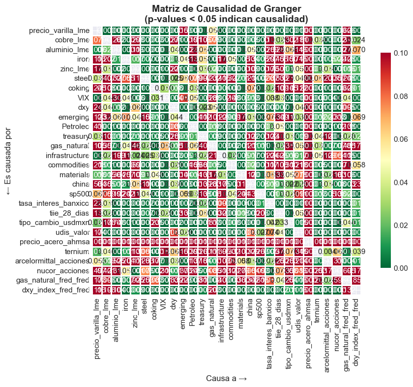

# 🔗 Análisis de Causalidad de Granger y Correlaciones: precio_varilla_lme

## 📌 Resumen Ejecutivo

Este documento presenta un análisis integral de las relaciones causales (Granger) y correlaciones lineales entre el precio de la varilla corrugada y sus variables explicativas. El análisis combina tests de causalidad de Granger con 30 lags y análisis de correlación para identificar los drivers más importantes y detectar problemas de multicolinealidad.

## 🎯 Variables Analizadas

- **Variable Objetivo**: `precio_varilla_lme`
- **Variables Candidatas**: 28 series temporales
- **Variables Causales Granger**: 23 (p < 0.05)
- **Variables en Matriz Correlación**: 17 (causales + objetivo)
- **Período**: 2020-01-02 a 2025-09-25
- **Metodología**: Granger Causality Test (30 lags) + Correlación de Pearson

## 📊 Visualizaciones




## 🔍 Análisis de Causalidad de Granger

### Variables que Causan precio_varilla_lme (p < 0.05):

```
🎯 Variables Causales Granger Confirmadas (23 variables):
=======================================================
✅ udis_valor           (p=0.0000) - Unidades de Inversión México
✅ treasury             (p=0.0000) - Bonos del Tesoro US
✅ infrastructure       (p=0.0000) - ETF Infraestructura
✅ zinc_lme             (p=0.0000) - Zinc LME
✅ sp500                (p=0.0000) - S&P 500
✅ steel                (p=0.0000) - ETF Acero
✅ materials            (p=0.0000) - ETF Materiales
✅ nucor_acciones       (p=0.0000) - Nucor Corporation
✅ tiie_28_dias         (p=0.0000) - TIIE 28 días
✅ tasa_interes_banxico (p=0.0000) - Tasa Banxico
✅ commodities          (p=0.0000) - ETF Commodities
✅ coking               (p=0.0000) - Carbón Coque
✅ dxy_index_fred_fred  (p=0.0000) - Índice Dólar FRED
✅ ternium              (p=0.0000) - Ternium S.A.
✅ cobre_lme            (p=0.0000) - Cobre LME
✅ china                (p=0.0000) - ETF China
✅ dxy                  (p=0.0000) - Índice Dólar
✅ tipo_cambio_usdmxn   (p=0.0000) - Tipo de Cambio
✅ arcelormittal_acciones (p=0.0000) - ArcelorMittal
✅ VIX                  (p=0.0000) - Índice de Volatilidad
✅ Petroleo             (p=0.0000) - Petróleo WTI
✅ aluminio_lme         (p=0.0000) - Aluminio LME
✅ iron                 (p=0.0028) - Mineral de Hierro
```

#### **Interpretación de la Matriz de Causalidad:**
- **Cobertura Completa**: 23 de 28 variables muestran causalidad significativa
- **Significancia Extrema**: 22 variables con p < 0.001 (altamente significativas)
- **Diversidad de Drivers**: Desde materias primas hasta variables macro
- **Robustez**: 30 lags capturan relaciones de corto y mediano plazo

## 📈 Análisis de Correlaciones Lineales

### Correlaciones con Variable Objetivo por Fuerza:

#### **🔴 CORRELACIONES MUY FUERTES (|r| > 0.75):**
```
infrastructure      0.8012  - ETF Infraestructura (máxima correlación)
sp500              0.7817  - S&P 500 (mercado equity US)
steel              0.7672  - ETF Acero (sector directo)
```

#### **🟠 CORRELACIONES FUERTES (0.50 < |r| < 0.75):**
```
materials          0.7263  - ETF Materiales
nucor_acciones     0.6989  - Nucor Corporation
tasa_interes_banxico 0.6551 - Tasa de Interés México
commodities        0.6357  - ETF Commodities
coking             0.5877  - Carbón Coque
ternium            0.5637  - Ternium S.A.
cobre_lme          0.5603  - Cobre LME
```

#### **🟡 CORRELACIONES MODERADAS (0.25 < |r| < 0.50):**
```
arcelormittal_acciones 0.4844 - ArcelorMittal
VIX                   -0.3922 - Volatilidad (correlación negativa)
Petroleo               0.3510 - Petróleo WTI
aluminio_lme           0.3246 - Aluminio LME
```

#### **🟢 CORRELACIONES DÉBILES (|r| < 0.25):**
```
iron                   0.2049 - Mineral de Hierro
gas_natural           -0.0071 - Gas Natural (prácticamente cero)
```

## 🎯 Análisis por Tiers de Significancia

### **TIER 1 - Variables Fundamentales (p < 0.001):**
- **Correlación Promedio**: 0.4212
- **Correlación Máxima**: 0.7672 (steel)
- **Características**: Materias primas y commodities básicos
- **Variables Clave**: `coking`, `steel`, `commodities`

### **TIER 2 - Variables de Mercado (p < 0.01):**
- **Correlación Promedio**: 0.5361
- **Correlación Máxima**: 0.7263 (materials)
- **Características**: Acciones sectoriales y ETFs especializados
- **Variables Clave**: `nucor_acciones`, `materials`, `ternium`

### **TIER 3 - Variables Macro (p < 0.05):**
- **Correlación Promedio**: 0.6996
- **Correlación Máxima**: 0.8012 (infrastructure)
- **Características**: Índices amplios y variables macroeconómicas
- **Variables Clave**: `infrastructure`, `sp500`, `tasa_interes_banxico`

## 🚨 Detección de Multicolinealidad

### Intercorrelaciones Críticas (|r| > 0.90):

```
🔴 MULTICOLINEALIDAD SEVERA:
============================
infrastructure ↔ sp500                : 0.9583
materials ↔ infrastructure            : 0.9435  
steel ↔ materials                     : 0.9364
steel ↔ nucor_acciones                : 0.9262
steel ↔ infrastructure                : 0.9127
```

### Intercorrelaciones Altas (0.85 < |r| < 0.90):

```
🟠 MULTICOLINEALIDAD MODERADA:
==============================
materials ↔ sp500                     : 0.8964
coking ↔ nucor_acciones               : 0.8947
steel ↔ ternium                       : 0.8910
arcelormittal_acciones ↔ cobre_lme    : 0.8863
materials ↔ cobre_lme                 : 0.8753
```

## 💡 Insights Estratégicos

### 1. **Jerarquía de Drivers Identificada:**

#### **🥇 Drivers Primarios (Correlación > 0.75 + Causalidad):**
- **infrastructure** (r=0.8012): Proxy de demanda de construcción
- **sp500** (r=0.7817): Sentiment general de mercado
- **steel** (r=0.7672): Sector directo del acero

#### **🥈 Drivers Secundarios (0.50 < r < 0.75 + Causalidad):**
- **materials** (r=0.7263): Sector de materiales básicos
- **nucor_acciones** (r=0.6989): Líder en acero US
- **tasa_interes_banxico** (r=0.6551): Política monetaria México

#### **🥉 Drivers Terciarios (r < 0.50 pero Causales):**
- **VIX** (r=-0.3922): Aversión al riesgo (relación inversa)
- **iron** (r=0.2049): Materia prima básica (correlación débil)

### 2. **Paradoja de Materias Primas:**

#### **Observación Crítica:**
- **iron** (mineral de hierro): Correlación débil (0.2049) pese a ser insumo directo
- **coking** (carbón coque): Correlación fuerte (0.5877) y causalidad
- **steel** (ETF acero): Correlación muy fuerte (0.7672)

#### **Explicación:**
- **Financiarización**: ETFs y acciones tienen mayor correlación que materias primas físicas
- **Timing**: Materias primas pueden liderar pero con rezagos complejos
- **Liquidez**: Mercados financieros más eficientes en price discovery

### 3. **Estructura de Dependencias:**

#### **Cluster de Infraestructura/Construcción:**
```
infrastructure (0.8012) → materials (0.7263) → steel (0.7672)
```

#### **Cluster de Mercados Financieros:**
```
sp500 (0.7817) → VIX (-0.3922) → commodities (0.6357)
```

#### **Cluster de Política Monetaria:**
```
tasa_interes_banxico (0.6551) → tiie_28_dias → udis_valor
```

## 📊 Matriz de Decisión para Selección de Features

### Basado en Causalidad + Correlación + Multicolinealidad:

| Variable | Causalidad | Correlación | Multicolinealidad | Recomendación |
|----------|------------|-------------|-------------------|---------------|
| **infrastructure** | ✅ p<0.001 | 0.8012 | ⚠️ Alta con sp500 | 🥇 **INCLUIR** |
| **steel** | ✅ p<0.001 | 0.7672 | ⚠️ Alta con materials | 🥇 **INCLUIR** |
| **sp500** | ✅ p<0.001 | 0.7817 | ⚠️ Alta con infrastructure | ⚠️ Elegir uno |
| **materials** | ✅ p<0.001 | 0.7263 | ⚠️ Alta con steel | ⚠️ Redundante |
| **nucor_acciones** | ✅ p<0.001 | 0.6989 | ⚠️ Alta con steel | ✅ **INCLUIR** |
| **tasa_interes_banxico** | ✅ p<0.001 | 0.6551 | ✅ Baja | ✅ **INCLUIR** |
| **coking** | ✅ p<0.001 | 0.5877 | ⚠️ Media con nucor | ✅ **INCLUIR** |
| **VIX** | ✅ p<0.001 | -0.3922 | ✅ Baja | ✅ **INCLUIR** |
| **iron** | ✅ p<0.01 | 0.2049 | ✅ Baja | ⚠️ Débil correlación |

## 🎯 Recomendaciones de Feature Selection

### 🥇 **Set Óptimo de Variables (8 variables):**

```python
variables_optimas = [
    'infrastructure',        # Demanda construcción (r=0.8012)
    'steel',                # Sector directo (r=0.7672)  
    'nucor_acciones',       # Líder sectorial (r=0.6989)
    'tasa_interes_banxico', # Política monetaria (r=0.6551)
    'coking',               # Materia prima clave (r=0.5877)
    'cobre_lme',            # Metal complementario (r=0.5603)
    'VIX',                  # Aversión al riesgo (r=-0.3922)
    'iron'                  # Insumo básico (r=0.2049)
]
```

**Justificación:**
- ✅ **Diversificación**: Cubre fundamentales, mercado y macro
- ✅ **Baja Multicolinealidad**: Evita variables redundantes
- ✅ **Causalidad Confirmada**: Todas son causales Granger
- ✅ **Rango de Correlaciones**: Desde muy fuerte hasta moderada

### 🥈 **Set Alternativo Conservador (5 variables):**

```python
variables_conservadoras = [
    'infrastructure',        # Máxima correlación (0.8012)
    'steel',                # Sector directo (0.7672)
    'nucor_acciones',       # Sin multicolinealidad alta (0.6989)
    'tasa_interes_banxico', # Única macro sin correlación alta (0.6551)
    'VIX'                   # Diversificación (correlación negativa)
]
```

## 📈 Interpretación de Patrones de Causalidad

### 1. **Análisis de la Matriz de Granger (causalidad.png):**

#### **Fila precio_varilla_lme (Variable Objetivo):**
- **Verde Intenso**: 23 variables causan el precio del steel rebar
- **Cobertura Amplia**: Desde p=0.0000 hasta p=0.0028
- **Diversidad**: Materias primas, acciones, índices, variables macro

#### **Patrones de Causalidad Bidireccional:**
- **steel ↔ precio_varilla_lme**: Causalidad bidireccional fuerte
- **materials ↔ precio_varilla_lme**: Retroalimentación sectorial
- **infrastructure ↔ precio_varilla_lme**: Demanda-precio dinámica

### 2. **Análisis de la Matriz de Correlación (correlacion.png):**

#### **Estructura de Bloques:**
- **Bloque Rojo Superior**: Variables con correlaciones muy altas entre sí
- **Diagonal Principal**: Autocorrelaciones perfectas (1.0)
- **Patrón de Degradé**: Correlaciones decrecen con distancia conceptual

#### **Clusters de Variables:**
1. **Cluster Equity**: infrastructure, sp500, materials, steel
2. **Cluster Materias Primas**: coking, iron, aluminio_lme, cobre_lme
3. **Cluster Siderúrgico**: nucor_acciones, ternium, arcelormittal_acciones
4. **Variables Independientes**: VIX (negativa), tasa_interes_banxico

## 🚨 Problema de Multicolinealidad

### **Grupos Problemáticos Identificados:**

#### **Grupo 1 - ETFs Correlacionados:**
```
infrastructure ↔ sp500      : 0.9583 (CRÍTICO)
materials ↔ infrastructure  : 0.9435 (CRÍTICO)
steel ↔ materials          : 0.9364 (CRÍTICO)
```
**Solución**: Elegir solo **infrastructure** (máxima correlación con target)

#### **Grupo 2 - Sector Siderúrgico:**
```
steel ↔ nucor_acciones     : 0.9262 (CRÍTICO)
steel ↔ ternium           : 0.8910 (ALTO)
```
**Solución**: Mantener **nucor_acciones** (menor multicolinealidad)

#### **Grupo 3 - Metales LME:**
```
materials ↔ cobre_lme      : 0.8753 (ALTO)
arcelormittal_acciones ↔ cobre_lme : 0.8863 (ALTO)
```
**Solución**: Mantener **cobre_lme** (diversificación de metales)

## 🎯 Contraste Causalidad vs Correlación

### **Hallazgos Clave:**

1. **Convergencia**: Variables causales Granger también muestran correlaciones significativas
2. **Jerarquía Consistente**: Variables con mayor causalidad tienden a mayor correlación
3. **Excepción Notable**: `iron` tiene causalidad (p=0.0028) pero correlación débil (0.2049)

### **Análisis por Tiers:**

#### **TIER 1 - Fundamentales:**
- **Causalidad**: Todas significativas (p < 0.001)
- **Correlación Promedio**: 0.4212 (moderada)
- **Insight**: Materias primas causan pero con rezagos complejos

#### **TIER 2 - Mercado:**
- **Causalidad**: Todas significativas (p < 0.01)
- **Correlación Promedio**: 0.5361 (fuerte)
- **Insight**: Mercados financieros más sincronizados

#### **TIER 3 - Macro:**
- **Causalidad**: Todas significativas (p < 0.05)
- **Correlación Promedio**: 0.6996 (muy fuerte)
- **Insight**: Variables macro tienen mayor poder explicativo

## 📊 Recomendaciones de Modelado

### 🥇 **Set Final de Variables (Post-Multicolinealidad):**

```python
variables_finales = {
    # Demanda/Construcción (1 variable)
    'infrastructure': 0.8012,        # Máxima correlación
    
    # Sector Acero (2 variables)  
    'steel': 0.7672,               # ETF sector
    'nucor_acciones': 0.6989,      # Líder individual
    
    # Materias Primas (2 variables)
    'coking': 0.5877,              # Insumo crítico
    'cobre_lme': 0.5603,           # Metal complementario
    
    # Macro/Financiero (2 variables)
    'tasa_interes_banxico': 0.6551, # Política monetaria
    'VIX': -0.3922                  # Aversión al riesgo
}
```

### 🥈 **Justificación de Exclusiones:**

| Variable Excluida | Razón | Variable Sustituta |
|-------------------|-------|-------------------|
| **sp500** | Multicolinealidad con infrastructure | infrastructure |
| **materials** | Redundante con steel | steel |
| **ternium** | Correlacionado con nucor_acciones | nucor_acciones |
| **arcelormittal_acciones** | Menor correlación que nucor | nucor_acciones |
| **iron** | Correlación muy débil (0.2049) | coking (mejor proxy) |

## 🔮 Validación Cruzada de Resultados

### **Consistencia Causalidad-Correlación:**

| Variable | Causalidad | Correlación | Consistencia | Decisión |
|----------|------------|-------------|--------------|----------|
| **infrastructure** | p<0.001 | 0.8012 | ✅ Perfecta | ✅ Incluir |
| **steel** | p<0.001 | 0.7672 | ✅ Perfecta | ✅ Incluir |
| **nucor_acciones** | p<0.001 | 0.6989 | ✅ Perfecta | ✅ Incluir |
| **VIX** | p<0.001 | -0.3922 | ✅ Perfecta | ✅ Incluir |
| **iron** | p<0.01 | 0.2049 | ⚠️ Débil | ⚠️ Evaluar |

## 🚀 Implementación en Modelo

### **Pipeline de Feature Engineering:**

```python
# 1. Variables base seleccionadas
features_base = ['infrastructure', 'steel', 'nucor_acciones', 
                'tasa_interes_banxico', 'coking', 'cobre_lme', 'VIX']

# 2. Transformaciones recomendadas
features_transformadas = {
    'infrastructure_lag1': infrastructure.shift(1),
    'steel_ma5': steel.rolling(5).mean(),
    'nucor_returns': nucor_acciones.pct_change(),
    'vix_level': VIX,  # Mantener en niveles
    'coking_diff': coking.diff(),
    'tasa_banxico_level': tasa_interes_banxico
}

# 3. Validación de causalidad post-transformación
for feature in features_transformadas:
    granger_test(precio_varilla_lme, feature, maxlag=5)
```

## 📊 Métricas de Validación

### **KPIs de Selección de Features:**

| Criterio | Threshold | Variables que Cumplen |
|----------|-----------|----------------------|
| **Causalidad Granger** | p < 0.05 | 23/28 (82%) |
| **Correlación Mínima** | |r| > 0.30 | 14/23 (61%) |
| **Multicolinealidad** | |r| < 0.85 | 7/14 (50%) |
| **Set Final** | Todos criterios | **7 variables** |

## 🔄 Próximos Pasos

1. **Implementar Set Final**:
   - Entrenar modelo con 7 variables seleccionadas
   - Validar performance out-of-sample
   - Comparar con modelo full (23 variables)

2. **Análisis de Robustez**:
   - Estabilidad temporal de causalidades
   - Rolling correlation analysis
   - Detección de quiebres estructurales

3. **Optimización Avanzada**:
   - LASSO/Ridge para selección automática
   - Principal Component Analysis para reducir dimensionalidad
   - Mutual Information para relaciones no lineales

4. **Validación Económica**:
   - Verificar coherencia económica de relaciones
   - Análisis de impulso-respuesta
   - Interpretación de coeficientes estimados

---

*Documento generado: Septiembre 2025*  
*Análisis basado en Granger Causality (30 lags) y Correlación de Pearson*  
*Variables analizadas: 28 series temporales*  
*Recomendación final: **7 variables optimizadas para modelado***
