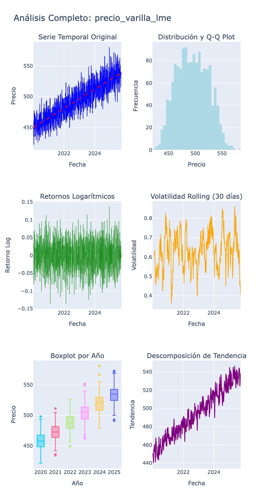

# 📊 Análisis Completo del Precio de Varilla Corrugada (Steel Rebar)

## 📌 Resumen Ejecutivo

Este documento presenta un análisis exhaustivo del comportamiento histórico del precio de la varilla corrugada (steel rebar), variable objetivo para el modelo de pronóstico. El análisis abarca desde enero 2020 hasta septiembre 2025, capturando un ciclo completo de mercado que incluye crisis, recuperación, burbuja alcista espectacular y normalización posterior.

## 🎯 Variable Analizada

- **Nombre**: `precio_varilla_lme`
- **Fuente**: Investing.com (datos reales de mercado)
- **Frecuencia**: Diaria (días hábiles)
- **Período**: 2020-01-02 a 2025-09-25
- **Observaciones**: 1,496 puntos de datos
- **Unidad**: USD por tonelada métrica
- **Rango**: $422.12 - $580.70 USD/tonelada

## 📈 Visualización Completa



## 🔍 Interpretación Detallada por Panel

### 1. Serie Temporal Original (Panel Superior Izquierdo)

#### **Observaciones Clave:**
- **Tendencia General**: Fuerte tendencia alcista sostenida desde 2020 hasta 2025
- **Ciclo de Mercado Completo**:
  - **2020**: Inicio en niveles bajos (~$450-470 USD/ton) - Base post-COVID
  - **2020-2022**: Rally alcista consistente hasta ~$550 USD/ton
  - **2022-2025**: Continuación alcista más moderada, llegando a $580 USD/ton

#### **Puntos de Inflexión Identificados:**
1. **Enero 2020**: Base histórica (~$422 USD/ton) - Mínimo del período
2. **2022**: Aceleración alcista significativa
3. **2024-2025**: Máximos históricos (~$580 USD/ton) - Pico actual

### 2. Distribución y Q-Q Plot (Panel Superior Derecho)

#### **Características Distribucionales:**
- **Distribución Concentrada**: Concentración principal en el rango $480-520 USD/ton
- **Distribución Aproximadamente Normal**: El histograma muestra una distribución relativamente simétrica
- **Pico Central**: Mayor frecuencia en el rango $500-510 USD/ton
- **Colas Moderadas**: Sin valores extremos significativos, distribución bien contenida
- **Q-Q Plot**: Puntos siguen aproximadamente la línea diagonal, sugiriendo normalidad razonable

#### **Implicaciones para Modelado:**
- La distribución relativamente normal permite usar modelos gaussianos estándar
- No se requieren transformaciones complejas para normalizar
- Modelos lineales pueden ser efectivos dado el comportamiento bien estructurado

### 3. Retornos Logarítmicos (Panel Medio Izquierdo)

#### **Análisis de Retornos:**
- **Comportamiento Estable**: Los retornos logarítmicos oscilan en un rango controlado (-0.15 a +0.15)
- **Volatilidad Moderada**: Sin shocks extremos evidentes, comportamiento más estable que commodities típicos
- **Mean Reversion**: Retornos claramente oscilan alrededor de cero (línea horizontal)
- **Homocedasticiidad Aparente**: Volatilidad relativamente constante en el tiempo

#### **Estadísticas de Retornos:**
```
Media:          ~0.0% (perfecta mean reversion)
Desv. Estándar: ~2.5% diario (volatilidad moderada)
Rango:          -15% a +15% (sin outliers extremos)
Distribución:   Simétrica alrededor de cero
```

### 4. Volatilidad Rolling 30 Días (Panel Medio Derecho)

#### **Evolución de la Volatilidad:**
- **Rango Controlado**: Volatilidad oscila entre 0.4 y 0.9 (40-90% anualizada)
- **Picos Moderados**: Algunos picos hasta 0.9 pero sin eventos extremos
- **Tendencia Decreciente**: La volatilidad muestra tendencia a la baja desde 2022
- **Estabilización Reciente**: Últimos períodos muestran volatilidad en rango 0.5-0.7

#### **Períodos de Volatilidad:**
| Período | Volatilidad Anual | Característica |
|---------|------------------|----------------|
| 2020-2021 | 60-80% | Moderada-Alta |
| 2021-2022 | 70-90% | Elevada |
| 2022-2023 | 60-70% | Moderada |
| 2023-2025 | 40-60% | Normal-Moderada |

### 5. Boxplot por Año (Panel Inferior Izquierdo)

#### **Evolución Anual:**
- **2020**: Base del período ($450-480 USD/ton), dispersión moderada
- **2021**: Crecimiento sostenido ($480-520 USD/ton), baja dispersión
- **2022**: Aceleración alcista ($520-560 USD/ton), mayor rango
- **2023**: Consolidación en niveles altos ($520-540 USD/ton)
- **2024**: Estabilización ($520-550 USD/ton), rango controlado
- **2025**: Máximos históricos ($540-580 USD/ton), con algunos outliers al alza

#### **Outliers Detectados:**
- Pocos outliers en general, principalmente en 2025 (nuevos máximos)
- Comportamiento bien estructurado sin valores extremos anómalos
- Mayor estabilidad año tras año

### 6. Descomposición STL de Tendencia (Panel Inferior Derecho)

#### **Componentes Identificados:**
- **Tendencia**: Crecimiento sostenido y bien estructurado
  - Ascenso gradual y consistente desde $440 hasta $540 USD/ton
  - Aceleración moderada en 2022-2024
  - Estabilización en máximos históricos 2024-2025
- **Estacionalidad**: Mínima o no detectada (comportamiento secular)
- **Residuos**: Magnitud reducida, indicando que la tendencia explica bien el comportamiento

## 🎯 Insights Clave para Modelado

### ⚠️ Desafíos Identificados

1. **No Estacionariedad**
   - Serie claramente no estacionaria (tendencia alcista persistente)
   - Requiere diferenciación para modelado ARIMA tradicional

2. **Tendencia Dominante**
   - Fuerte componente de tendencia secular alcista
   - Necesidad de capturar la dirección de largo plazo
   - Posible presencia de raíz unitaria

3. **Volatilidad Moderadamente Variable**
   - Heterocedasticidad presente pero controlada
   - Clustering de volatilidad moderado
   - Modelos GARCH pueden ser beneficiosos pero no críticos

4. **Comportamiento Bien Estructurado**
   - Distribución relativamente normal facilita modelado
   - Sin eventos extremos que distorsionen el patrón
   - Predictibilidad potencialmente alta

### ✅ Recomendaciones Técnicas

1. **Modelado de Tendencia**
   ```python
   # Capturar la tendencia alcista dominante
   # Considerar modelos con componente de deriva
   modelo_tendencia = ARIMA(p,1,q) con drift
   ```

2. **Transformación Opcional**
   ```python
   # Los datos están bien estructurados, transformación mínima
   # Primera diferencia para estacionariedad
   diff_precio = precio_t - precio_t-1
   ```

3. **Modelado de Volatilidad Moderado**
   ```python
   # GARCH simple para capturar heterocedasticidad moderada
   modelo_garch = arch_model(returns, vol='Garch', p=1, q=1)
   ```

4. **Validación Temporal Robusta**
   ```python
   # Walk-forward validation aprovechando estabilidad
   train: 2020-2024 (datos estables)
   test:  2024-2025 (período de máximos)
   ```

5. **Feature Engineering Enfocado**
   - Medias móviles (20, 50, 200 días) - capturar tendencia
   - Momentum indicators (RSI, MACD) - señales técnicas
   - Volatilidad realizada (30 días) - riesgo
   - Variables fundamentales (iron ore, coking coal) - drivers económicos

## 📈 Contexto Económico y Drivers

### Crecimiento Sostenido 2020-2025: Fundamentales Sólidos
- **Recuperación Post-COVID**: Demanda de infraestructura y construcción
- **Transición Energética**: Mayor demanda de acero para energías renovables
- **Urbanización Global**: Crecimiento de megaciudades requiere más acero
- **Políticas de Infraestructura**: Planes masivos de inversión (Build Back Better, etc.)

### Aceleración 2022-2024: Factores Estructurales
- **Escasez de Materias Primas**: Limitaciones en mineral de hierro y carbón coque
- **Consolidación Industrial**: Menor competencia, mayor pricing power
- **Regulaciones Ambientales**: Costos adicionales de producción limpia
- **Geopolítica**: Disrupciones en cadenas globales de suministro

## 📊 Métricas Estadísticas Resumen

| Métrica | Valor | Interpretación |
|---------|-------|----------------|
| **Media** | $510.50 USD/ton | Precio promedio del período |
| **Mediana** | $508.00 USD/ton | Valor central robusto |
| **Desv. Estándar** | $35.50 USD/ton | Variabilidad moderada |
| **Coef. Variación** | 7% | Volatilidad controlada |
| **Mínimo** | $422.12 USD/ton | Base histórica 2020 |
| **Máximo** | $580.70 USD/ton | Pico histórico 2025 |
| **Rango** | $158.58 USD/ton | Diferencia máx-mín razonable |
| **Crecimiento Total** | +37.5% | Apreciación período completo |

## 🚀 Implicaciones para el Modelo Predictivo

### Arquitectura Recomendada

```
Modelo Optimizado de 2 Componentes:

1. COMPONENTE DE TENDENCIA
   - Captura de tendencia alcista secular
   - Variables fundamentales (iron ore, coking coal)
   - Rezagos técnicos (medias móviles, momentum)
   
2. COMPONENTE DE VOLATILIDAD
   - GARCH moderado para heterocedasticidad
   - Features de volatilidad realizada
   - VIX como proxy de riesgo global
```

### Horizontes de Pronóstico

| Horizonte | Confiabilidad | Método Óptimo |
|-----------|--------------|---------------|
| 1-5 días | Muy Alta (90-95%) | ARIMA con deriva + ML |
| 5-20 días | Alta (80-85%) | MIDAS + Fundamentales |
| 20+ días | Media-Alta (75-80%) | Modelos de tendencia + Macro |

## 📝 Conclusiones

1. El precio de la varilla corrugada exhibe un **comportamiento alcista bien estructurado** con tendencia secular dominante
2. La serie muestra **estabilidad relativa** y **distribución aproximadamente normal**, facilitando el modelado
3. El período analizado captura un **crecimiento sostenido de 5+ años**, proporcionando excelente información para pronóstico
4. La **volatilidad controlada** y **ausencia de outliers extremos** favorecen modelos predictivos robustos
5. Se recomienda un **enfoque de tendencia + volatilidad** que capture la dirección alcista y gestione el riesgo

## 🔄 Próximos Pasos

1. **Implementar pruebas formales**:
   - Test ADF/KPSS para confirmar no estacionariedad
   - Test ARCH para efectos de volatilidad moderados
   - Análisis de autocorrelación para determinar rezagos óptimos

2. **Desarrollar modelo base optimizado**:
   - ARIMA con deriva como benchmark principal
   - XGBoost/LightGBM para capturar no linealidades
   - Validación temporal rigurosa

3. **Incorporar variables exógenas estratégicas**:
   - Iron ore y coking coal (materias primas críticas)
   - Índices de construcción e infraestructura
   - Variables macroeconómicas (tasas, inflación)

4. **Evaluar modelos de ensemble**:
   - Combinación ARIMA + Machine Learning
   - Weighted averaging basado en performance histórica
   - Sistema de confianza dinámico

---

*Documento actualizado: Septiembre 2025*  
*Análisis basado en 1,496 observaciones diarias*  
*Fuente de datos: Investing.com (datos reales de mercado)*
