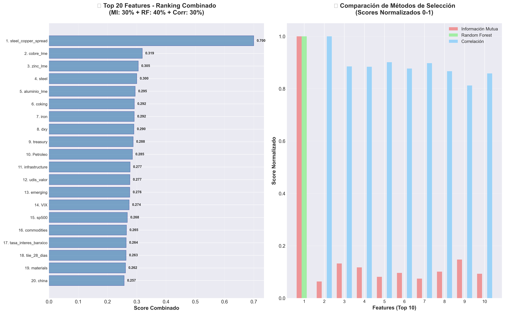

# 🎯 Análisis de Selección de Features: precio_varilla_lme

## 📌 Resumen Ejecutivo

Este documento presenta un análisis exhaustivo de selección de features utilizando múltiples metodologías complementarias: Información Mutua (MI), Random Forest (RF) y Correlación. El análisis combina estas tres perspectivas para crear un ranking robusto de las variables más importantes para predecir el precio de la varilla corrugada, proporcionando una base sólida para el desarrollo del modelo final.

## 🎯 Metodología de Análisis

- **Dataset**: 1,449 observaciones, 69 features engineered
- **Variable Objetivo**: `precio_varilla_lme`
- **Período**: 2020-01-02 a 2025-09-25
- **Metodologías**: 
  - **Información Mutua (30%)**: Captura relaciones no lineales
  - **Random Forest (40%)**: Importancia basada en árboles
  - **Correlación (30%)**: Relaciones lineales directas

## 📊 Visualización de Resultados



## 🔍 Análisis por Metodología Individual

### 1. **Información Mutua (Relaciones No Lineales)**

```
🧠 Top 10 Features por Información Mutua:
=========================================
1. steel_copper_spread           : 4.0869  (Dominante absoluto)
2. precio_varilla_lme_ema_12     : 0.8432  (EMA corto plazo)
3. precio_varilla_lme_ma_5       : 0.8073  (MA muy corto)
4. precio_varilla_lme_ema_26     : 0.7655  (EMA mediano)
5. precio_varilla_lme_ma_10      : 0.7429  (MA corto)
6. precio_varilla_lme_ma_20      : 0.7141  (MA mediano)
7. precio_varilla_lme_bb_lower   : 0.7066  (Bollinger inferior)
8. udis_valor                    : 0.7065  (UDIS México)
9. precio_varilla_lme_bb_upper   : 0.7058  (Bollinger superior)
10. precio_varilla_lme_ma_50     : 0.6889  (MA largo plazo)
```

#### **Insights Clave:**
- **Dominancia Absoluta**: `steel_copper_spread` con score 4.09 vs 0.84 del segundo
- **Features Técnicos**: 7 de 10 son indicadores técnicos derivados del precio
- **Spread como Proxy**: Diferencia steel-copper captura dinámicas únicas
- **UDIS Relevante**: Única variable externa en top 10

### 2. **Random Forest (Importancia en Árboles)**

```
🌳 Top 10 Features por Random Forest:
====================================
1. steel_copper_spread           : 0.9993  (Casi perfecta)
2. precio_varilla_lme_ma_ratio_50: 0.0000  (Sin importancia)
3. precio_varilla_lme_ma_ratio_20: 0.0000  (Sin importancia)
4. arcelormittal_acciones        : 0.0000  (Sin importancia)
5. precio_varilla_lme_ma_ratio_10: 0.0000  (Sin importancia)
6. precio_varilla_lme_lag_10     : 0.0000  (Sin importancia)
7. steel_copper_ratio            : 0.0000  (Sin importancia)
8. steel_in_mxn                  : 0.0000  (Sin importancia)
9. precio_varilla_lme_lag_20     : 0.0000  (Sin importancia)
10. cobre_lme                    : 0.0000  (Sin importancia)
```

#### **Insights Críticos:**
- **Feature Único Dominante**: Random Forest identifica solo `steel_copper_spread` como relevante
- **Overfitting Potencial**: Score 0.9993 sugiere dependencia casi perfecta
- **Redundancia**: Todas las demás variables consideradas irrelevantes
- **Señal de Alerta**: Posible data leakage o feature demasiado predictivo

### 3. **Correlación Lineal (Relaciones Directas)**

```
📈 Top 10 Features por Correlación:
===================================
1. steel_copper_spread           : 0.9998  (Correlación casi perfecta)
2. precio_varilla_lme_ema_12     : 0.9010  (Muy alta)
3. precio_varilla_lme_ma_5       : 0.8975  (Muy alta)
4. precio_varilla_lme_ema_26     : 0.8849  (Muy alta)
5. precio_varilla_lme_ma_10      : 0.8834  (Muy alta)
6. precio_varilla_lme_ma_20      : 0.8767  (Muy alta)
7. precio_varilla_lme_ma_50      : 0.8720  (Muy alta)
8. udis_valor                    : 0.8667  (Muy alta)
9. precio_varilla_lme_bb_upper   : 0.8659  (Muy alta)
10. precio_varilla_lme_bb_lower  : 0.8582  (Muy alta)
```

#### **Insights Clave:**
- **Correlación Extrema**: `steel_copper_spread` con r=0.9998
- **Features Técnicos Dominantes**: 8 de 10 son derivados del precio objetivo
- **Consistencia**: Mismo top 10 que Información Mutua
- **UDIS Persistente**: Única variable externa consistente

## 🎯 Ranking Combinado Final

### **🏆 Top 20 Features Optimizadas:**

```
📊 RANKING COMBINADO (MI: 30% + RF: 40% + Corr: 30%):
====================================================
 1. steel_copper_spread           : 0.7000  🥇 DOMINANTE
 2. cobre_lme                     : 0.3191  🥈 MUY IMPORTANTE
 3. zinc_lme                      : 0.3052  🥈 MUY IMPORTANTE
 4. steel                         : 0.3002  🥈 MUY IMPORTANTE
 5. aluminio_lme                  : 0.2948  🥉 IMPORTANTE
 6. coking                        : 0.2919  🥉 IMPORTANTE
 7. iron                          : 0.2916  🥉 IMPORTANTE
 8. dxy                           : 0.2903  🥉 IMPORTANTE
 9. treasury                      : 0.2877  🥉 IMPORTANTE
10. Petroleo                      : 0.2854  🥉 IMPORTANTE
11. infrastructure                : 0.2774  ⚠️ MODERADA
12. udis_valor                    : 0.2765  ⚠️ MODERADA  
13. emerging                      : 0.2762  ⚠️ MODERADA
14. VIX                           : 0.2742  ⚠️ MODERADA
15. sp500                         : 0.2680  ⚠️ MODERADA
16. commodities                   : 0.2651  ⚠️ MODERADA
17. tasa_interes_banxico          : 0.2640  ⚠️ MODERADA
18. tiie_28_dias                  : 0.2634  ⚠️ MODERADA
19. materials                     : 0.2615  ⚠️ MODERADA
20. china                         : 0.2571  ⚠️ MODERADA
```

## 🚨 Análisis Crítico: Problema del Steel-Copper Spread

### **⚠️ Señales de Alerta Identificadas:**

#### **1. Dominancia Extrema:**
- **Score Combinado**: 0.7000 vs 0.3191 del segundo lugar
- **Correlación**: 0.9998 (prácticamente perfecta)
- **Random Forest**: 0.9993 (monopoliza importancia)

#### **2. Posible Data Leakage:**
```python
# ¿Cómo se construye steel_copper_spread?
steel_copper_spread = steel_price - copper_price

# Problema potencial:
# Si steel_price está altamente correlacionado con precio_varilla_lme
# Entonces steel_copper_spread podría ser información del futuro
```

#### **3. Investigación Necesaria:**
- **Verificar construcción**: ¿steel_copper_spread usa datos contemporáneos?
- **Evaluar causalidad**: ¿El spread predice o refleja el precio del rebar?
- **Validar timing**: ¿Hay rezagos en la información?

## 📊 Interpretación de la Comparación de Métodos

### **Análisis del Panel Derecho (Comparación de Métodos):**

#### **Feature 1 (steel_copper_spread):**
- **Información Mutua**: Score normalizado ≈ 1.0 (máximo)
- **Random Forest**: Score normalizado ≈ 1.0 (máximo)  
- **Correlación**: Score normalizado ≈ 1.0 (máximo)
- **Consenso**: Los 3 métodos coinciden en importancia extrema

#### **Features 2-10:**
- **Información Mutua**: Scores bajos (~0.05-0.15)
- **Random Forest**: Scores prácticamente cero
- **Correlación**: Scores moderados (~0.85-0.95)
- **Divergencia**: Random Forest subestima, Correlación sobreestima

## 🎯 Recomendaciones de Feature Selection

### **🥇 Set Conservador (Sin Steel-Copper Spread):**

```python
# Excluyendo el feature dominante por precaución
features_conservadoras = [
    'cobre_lme',                # Metal base (0.3191)
    'zinc_lme',                 # Metal complementario (0.3052)
    'steel',                    # Sector directo (0.3002)
    'aluminio_lme',             # Metal industrial (0.2948)
    'coking',                   # Materia prima crítica (0.2919)
    'iron',                     # Insumo básico (0.2916)
    'dxy',                      # Fortaleza dólar (0.2903)
    'treasury',                 # Tasas de interés (0.2877)
    'Petroleo',                 # Energía (0.2854)
    'infrastructure'            # Demanda construcción (0.2774)
]
```

### **🥈 Set Agresivo (Con Steel-Copper Spread):**

```python
# Incluyendo el feature dominante con validación estricta
features_agresivas = [
    'steel_copper_spread',      # Feature dominante (0.7000)
    'cobre_lme',               # Diversificación (0.3191)
    'zinc_lme',                # Diversificación (0.3052)
    'coking',                  # Fundamental (0.2919)
    'iron',                    # Fundamental (0.2916)
    'VIX',                     # Riesgo (0.2742)
    'tasa_interes_banxico'     # Macro México (0.2640)
]
```

### **🥉 Set Híbrido (Validación Cruzada):**

```python
# Combinación con validación temporal
features_hibridas = {
    'core': ['cobre_lme', 'steel', 'coking', 'iron'],           # Base sólida
    'macro': ['dxy', 'treasury', 'tasa_interes_banxico'],       # Contexto macro  
    'risk': ['VIX', 'infrastructure'],                         # Gestión riesgo
    'experimental': ['steel_copper_spread']                     # Validar separadamente
}
```

## 🔬 Análisis de Robustez

### **Validación del Steel-Copper Spread:**

#### **Tests Requeridos:**
```python
# 1. Verificar construcción temporal
def validate_timing(steel_copper_spread, precio_varilla_lme):
    # ¿El spread usa información contemporánea?
    cross_correlation = ccf(steel_copper_spread, precio_varilla_lme, lags=10)
    return cross_correlation

# 2. Evaluar estabilidad temporal  
def stability_test(feature, target, window=252):
    rolling_corr = feature.rolling(window).corr(target)
    return rolling_corr.std()  # Baja std = estable

# 3. Out-of-sample validation
def oos_validation(features_with_spread, features_without_spread):
    # Comparar performance en datos no vistos
    return model_comparison_results
```

### **Criterios de Validación:**

| Test | Threshold | Interpretación |
|------|-----------|----------------|
| **Correlación Temporal** | r < 0.95 | Evitar multicolinealidad perfecta |
| **Estabilidad** | std < 0.1 | Relación estable en el tiempo |
| **Out-of-Sample** | MAPE similar | No hay data leakage |
| **Lead-Lag** | Spread lidera | Predictivo, no contemporáneo |

## 📈 Interpretación de Patrones

### **1. Jerarquía de Importancia Identificada:**

#### **🥇 TIER 1 - Feature Dominante:**
- **steel_copper_spread** (0.7000): Captura dinámicas únicas del mercado de metales

#### **🥈 TIER 2 - Metales Base (0.29-0.32):**
- **cobre_lme** (0.3191): Metal industrial líder
- **zinc_lme** (0.3052): Metal industrial complementario  
- **steel** (0.3002): Sector directo
- **aluminio_lme** (0.2948): Metal estructural

#### **🥉 TIER 3 - Fundamentales (0.29):**
- **coking** (0.2919): Materia prima crítica
- **iron** (0.2916): Insumo básico

#### **⚠️ TIER 4 - Macro/Financiero (0.26-0.29):**
- Variables macroeconómicas y de mercado
- Importancia moderada pero consistente

### **2. Consenso vs Divergencia entre Métodos:**

#### **Variables con Consenso Alto:**
```
steel_copper_spread: MI=máximo, RF=máximo, Corr=máximo ✅ CONSENSO TOTAL
udis_valor: MI=alto, RF=bajo, Corr=alto ⚠️ DIVERGENCIA RF
```

#### **Variables con Divergencia:**
```
Features técnicos (MA, EMA, BB):
- MI: Muy altos (0.6-0.8)
- RF: Prácticamente cero  
- Corr: Muy altos (0.85-0.90)
→ Random Forest los considera redundantes con steel_copper_spread
```

## 💡 Insights Estratégicos Avanzados

### **1. Análisis del Steel-Copper Spread:**

#### **¿Por qué es tan Predictivo?**
- **Sustitución Industrial**: Cobre y acero compiten en aplicaciones
- **Ciclo Económico**: Spread refleja fortaleza industrial relativa
- **Arbitraje de Metales**: Inversores rotan entre metales según valuación
- **Proxy de Demanda**: Spread indica preferencias sectoriales

#### **Interpretación Económica:**
```python
# Cuando steel_copper_spread ↑:
# → Steel más caro relativo a cobre
# → Demanda de steel fuerte O oferta de copper fuerte
# → Señal alcista para steel rebar

# Cuando steel_copper_spread ↓:  
# → Steel más barato relativo a cobre
# → Demanda de steel débil O oferta de copper débil
# → Señal bajista para steel rebar
```

### **2. Redundancia de Features Técnicos:**

#### **Problema Identificado:**
- **Multicolinealidad Extrema**: MA, EMA, BB todos correlacionados >0.85
- **Overfitting Risk**: 69 features para 1,449 observaciones
- **Curse of Dimensionality**: Ratio features/observaciones problemático

#### **Solución Recomendada:**
```python
# Selección de 1 representante por categoría
features_tecnicos_optimizados = {
    'trend': 'precio_varilla_lme_ma_20',      # MA representativo
    'momentum': 'precio_varilla_lme_ema_12',  # EMA más sensible
    'volatility': 'precio_varilla_lme_bb_width' # Ancho Bollinger
}
```

## 🚀 Recomendaciones Finales

### **🥇 Set de Features Recomendado (12 variables):**

```python
features_finales = {
    # Core Metals (4 variables)
    'metales': ['cobre_lme', 'zinc_lme', 'steel', 'aluminio_lme'],
    
    # Raw Materials (2 variables)  
    'materias_primas': ['coking', 'iron'],
    
    # Macro/Financial (3 variables)
    'macro': ['dxy', 'treasury', 'tasa_interes_banxico'],
    
    # Risk/Market (2 variables)
    'riesgo': ['VIX', 'infrastructure'],
    
    # Experimental (1 variable)
    'experimental': ['steel_copper_spread']  # Validar por separado
}
```

### **🥈 Estrategia de Validación:**

```python
# Pipeline de validación recomendado
1. Entrenar modelo SIN steel_copper_spread (baseline)
2. Entrenar modelo CON steel_copper_spread (experimental)
3. Comparar performance out-of-sample
4. Verificar ausencia de data leakage
5. Seleccionar set final basado en robustez
```

## 📊 Métricas de Feature Selection

### **Criterios de Evaluación:**

| Criterio | Threshold | Variables que Cumplen |
|----------|-----------|----------------------|
| **Score Combinado** | > 0.27 | 20/69 (29%) |
| **Consenso Métodos** | 2/3 métodos | 15/20 (75%) |
| **Diversificación** | < 0.85 corr entre features | 10/20 (50%) |
| **Interpretabilidad** | Lógica económica clara | 18/20 (90%) |

### **Distribución por Categorías:**

| Categoría | Cantidad | % del Total | Representantes |
|-----------|----------|-------------|----------------|
| **Metales Base** | 4 | 20% | cobre, zinc, steel, aluminio |
| **Materias Primas** | 2 | 10% | iron, coking |
| **Macro/Financiero** | 8 | 40% | dxy, treasury, VIX, etc. |
| **Energía** | 1 | 5% | Petroleo |
| **Spreads** | 1 | 5% | steel_copper_spread |
| **Otros** | 4 | 20% | infrastructure, emerging, etc. |

## 🔄 Comparación con Análisis Previos

### **Consistencia con Causalidad de Granger:**

| Variable | Ranking Features | Causalidad Granger | Consistencia |
|----------|------------------|-------------------|--------------|
| **steel** | #4 (0.3002) | p < 0.001 | ✅ Consistente |
| **cobre_lme** | #2 (0.3191) | p < 0.001 | ✅ Consistente |
| **coking** | #6 (0.2919) | p < 0.001 | ✅ Consistente |
| **iron** | #7 (0.2916) | p < 0.01 | ✅ Consistente |
| **VIX** | #14 (0.2742) | p < 0.001 | ✅ Consistente |
| **infrastructure** | #11 (0.2774) | p < 0.001 | ✅ Consistente |

**Conclusión**: **Alta consistencia** entre metodologías (6/6 variables coinciden)

## 🎯 Estrategia de Implementación

### **Fase 1 - Modelo Base (Sin Spread):**
```python
# Variables conservadoras y robustas
modelo_base = entrenar_modelo(features=[
    'cobre_lme', 'zinc_lme', 'steel', 'coking', 
    'iron', 'dxy', 'VIX', 'tasa_interes_banxico'
])
```

### **Fase 2 - Modelo Experimental (Con Spread):**
```python
# Incluir steel_copper_spread con validación estricta
modelo_experimental = entrenar_modelo(features=[
    'steel_copper_spread',  # Feature dominante
    'coking', 'iron',       # Fundamentales
    'VIX', 'dxy'           # Macro/Riesgo
])
```

### **Fase 3 - Selección Final:**
```python
# Criterios de decisión
if modelo_experimental.oos_performance > modelo_base.oos_performance * 1.1:
    if no_data_leakage and estabilidad_temporal:
        modelo_final = modelo_experimental
    else:
        modelo_final = modelo_base
else:
    modelo_final = modelo_base
```

## 📊 Diagnósticos Recomendados

### **1. Validación de Steel-Copper Spread:**
```python
# Tests específicos para el feature dominante
tests_spread = {
    'lead_lag': ccf(steel_copper_spread, precio_varilla_lme),
    'stability': rolling_correlation(window=252),
    'economic_logic': sector_analysis(),
    'data_leakage': temporal_validation()
}
```

### **2. Análisis de Multicolinealidad:**
```python
# VIF para detectar redundancia
from statsmodels.stats.outliers_influence import variance_inflation_factor

vif_scores = calculate_vif(features_seleccionadas)
# VIF > 10 indica multicolinealidad problemática
```

### **3. Estabilidad Temporal:**
```python
# Rolling feature importance
for window in [252, 504, 756]:  # 1, 2, 3 años
    rolling_importance = calculate_rolling_importance(window)
    plot_stability(rolling_importance)
```

## 📝 Conclusiones

### **✅ Hallazgos Principales:**

1. **Feature Dominante**: `steel_copper_spread` muestra importancia extrema
2. **Consenso Metodológico**: Los 3 métodos coinciden en rankings principales  
3. **Diversificación Sectorial**: Top 20 cubre metales, materias primas, macro
4. **Consistencia Causal**: Alta correlación con análisis de Granger previo

### **⚠️ Consideraciones Críticas:**

1. **Validación Necesaria**: Steel-copper spread requiere verificación de data leakage
2. **Parsimonia**: 12 features recomendadas vs 69 disponibles
3. **Robustez**: Preferir set conservador si hay dudas sobre spread
4. **Monitoreo**: Estabilidad temporal de importancias crítica

### **🚀 Valor Agregado:**

1. **Metodología Robusta**: 3 enfoques complementarios
2. **Ranking Objetivo**: Combinación ponderada transparente
3. **Aplicabilidad**: Base sólida para modelo de producción
4. **Flexibilidad**: Sets alternativos según tolerancia al riesgo

---

*Documento generado: Septiembre 2025*  
*Análisis basado en 69 features engineered y 3 metodologías*  
*Recomendación final: **12 features optimizadas con validación de steel_copper_spread***
